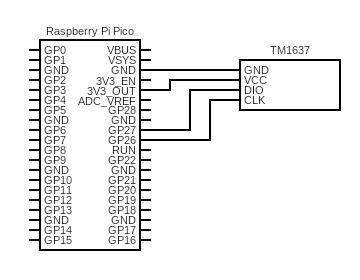

# Picoclock

Raspberry Pico W powered display for desktop or wall. Can be programmed to show different things. This example code includes showing data:

 - Current time (sync from worldtimeapi.org)
 - Current weather (from openweathermap.org)
 - Current energy spot price in Finland (from spot-hinta.fi)

# Code Remarks

Rename `config_example.py` to `config.py` and change the values to your own.

# Electronics

Picoclock is built using

 - Raspberry Pico W
 - 4 digit LED display TM1637 (used [these](https://www.amazon.de/dp/B07XQ2M188/) from Amazon.de)

Circuit diagram highlighting how to connect Pico to TM1637:

GPIO wiring:

Display added on top of Pico:

# 3D Printed Case

The base layer of the case is the same as in my Pikku controllers, [Pikku Dial](https://www.codeof.me/pikku-dial-multi-mode-dial-controller/) and [Pikku Macropad](https://www.codeof.me/pikku-raspberry-pi-pico-powered-macropad/). It fits the RPi Pico nicely and can different configurations on top of it. I designed a holder for 4-digit display and added a front panel with a slot for a glass lens to give it a retro futuristic look. I used [42mm lens from this Aliexpress seller](https://www.aliexpress.com/item/1005001538796925.html).

You can download STL files from [Printables.com](https://www.printables.com/model/570828).

# Credits

- TM1637 display code: https://github.com/mcauser/micropython-tm1637
- HTTP client: https://github.com/balloob/micropython-http-client